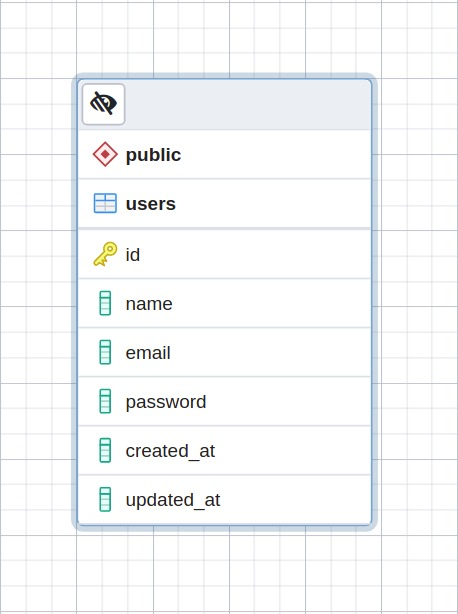
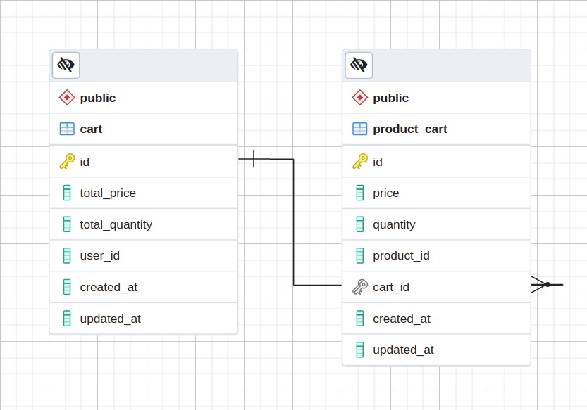
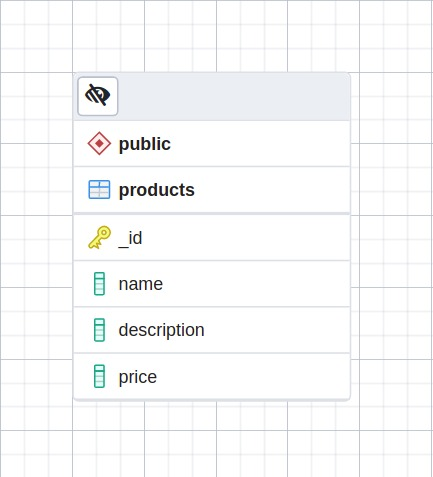

# 
Microservices NodeJS + TypeScript

***

## <i>Rest API</i>

A aplicação **./restapi** é responsável por gerenciar toda parte de usuários e requisições aos outros microservices. 

**Funcionalidades**
- Gerenciamento de usuários
- Autenticação JWT e Rate limite
- Gerenciamento das requisição para o microservice de Carrinho
- Gerenciamento das requisição para o microservice de Produtos

**Entity**

**EndPoints (Users + Session)**

Rotas | Método  | Descrição
------|-------- |--------
http://localhost:3333/sessions| POST | Realiza autenticação
http://localhost:3333//users/list| GET | Lista usuários
http://localhost:3333/users/:id| GET | Busca usuário
http://localhost:3333/users| POST | Cadastra usuário
http://localhost:3333/users/:id| PUT | Atualiza usuário
http://localhost:3333/users/:id| DELETE | Exclui usuário 

 

**EndPoints (Product Microservice)**
Rotas | Método  | Descrição
------|-------- |--------
http://localhost:3333/products| GET | Lista produtos
http://localhost:3333/products/:id| GET | Busca produto
http://localhost:3333/products| POST | Cadastra produto
http://localhost:3333/products/:id| PUT | Atualiza produto
http://localhost:3333/products/:id| DELETE | Exclui produto 

 

**EndPoints (Cart Microservice)**
Rotas | Método  | Descrição
------|-------- |--------
http://localhost:3333/carts/:id| GET | Busca carrinho
http://localhost:3333/carts| POST | Cadastra carrinho
http://localhost:3333/carts/product| PUT | Adiciona produto ao carrinho
http://localhost:3333/carts/product/:cart/:product| DELETE | Exclui produto do carrinho 

 

***

## <i>Cart Microservice</i> 

O microservice **./ms-cart** é responsável por gerenciar toda regra de negocio de um carrinho de compra e seus produto.  

**Funcionalidades**
- Gerenciamento de um carrinho 
- Gerenciamento dos produtos de um carrinho
- Efetividade nas regras de negocios em uma iteração de um carrinho

**Entities**

**Endpoints (Cart + Product Cart)**
Rotas | Método  | Descrição
------|-------- |--------
http://localhost:3334/cart/list| GET | Lista carrinhos
http://localhost:3334/cart/:id| GET | Busca carrinho
http://localhost:3334/cart| POST | Cadastra carrinho
http://localhost:3334/cart/:id| DELETE | Exclui carrinho
http://localhost:3334/product| POST | Adiciona produto ao carrinho
http://localhost:3334/product/:id| PUT | Atualiza produto do carrinho
http://localhost:3334/product/:id| DELETE | Exclui produto do carrinho

 

***

## <i>Product Microservice</i>

O microservice **./ms-product** é responsável por gerenciar os produtos

**Funcionalidades**
- Gerenciamento de produtos 

**Entity**

**EndPoints**
Rotas | Método  | Descrição
------|-------- |--------
http://localhost:3335/products| GET | Lista produtos
http://localhost:3335/products/:id| GET | Busca produto
http://localhost:3335/products| POST | Cadastra produto
http://localhost:3335/products/:id| PUT | Atualiza produto
http://localhost:3335/products/:id| DELETE | Exclui produto 